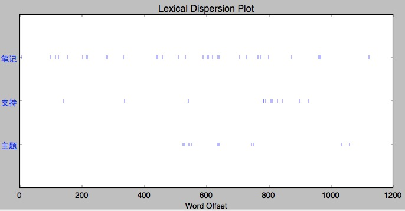
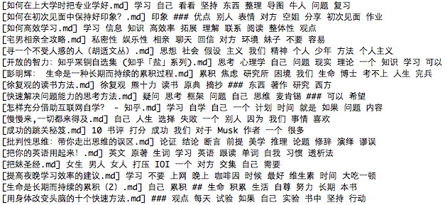
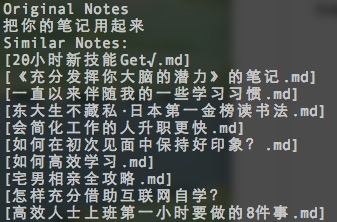
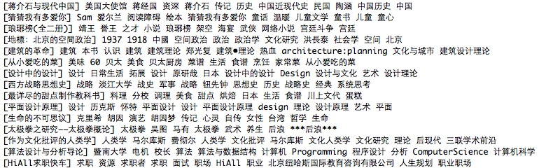
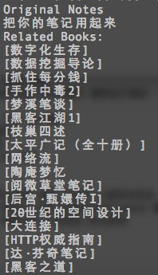

# WKK - wdxtub's Knowledge Kit

`WKK` is a set of tools that help me to get specific information I need, arrange my notes in a natural way as well as analyze the content of my notes and give me recommendations about books, wikis & news.

It can be regarded as an application that combines Evernote, RSS, Wikipedia together to make information retrieval/management easier.

`WKK` has the following modules:

+ `jarvis`: Personal Information Assistant(PIA), the brain of the `WKK` system
+ `nomadic`: A lightweight notes management system
+ `util`: Useful tools to import/export notes and other management actions

---

### Outlines of this README

<!-- MarkdownTOC -->

- JARVIS
    - Natural Language Processing
        - Tokenization
        - Tag Extraction
        - Stats Analysis
    - Recommendation system
        - Similar Notes
        - Related Books
    - Information retrieval
        - daily report content
        - Sources(Increasing)
- NOMADIC
    - Features
    - Setup
        - Installation
        - Configuration
        - The Daemon
        - Custom CSS
    - Usage
        - Browsing notes
        - Searching notes
        - Adding other files (images, etc)
        - Presentations(TODO)
        - Tips
    - Development
    - Screenshots
- UTIL
    - Kindle Clippings Import
    - Evernote Import
    - Format Cleaner
    - Format Converter
    - Push Service
- Acknowledgements

<!-- /MarkdownTOC -->


---

## JARVIS

Most of the features for jarvis are still quickly evolving, so at this point `jarvis` is separate from `nomadic` and `util`. When everything is working well for some time, I'll merge them together to be a complete product.

Also, as `nomadic` is the most available part of `WKK`, I only use a small set of notes in `nomadic` to test `jarvis's` algorithms.

### Natural Language Processing

> NLTK is a leading platform for building Python programs to work with human language data. It provides easy-to-use interfaces to over 50 corpora and lexical resources such as WordNet, along with a suite of text processing libraries for classification, tokenization, stemming, tagging, parsing, and semantic reasoning

However, NLTK doesn't support Chinese and most of its advanced techniques such as classification, tokenization, stemming, tagging, parsing and semantic reasoning are only for English. But NLTK provides lots of useful functions, so some extra work is needed to handle Chinese in NLTK.

There are some toolkit for Chinese text processing such as [SnowNLP](https://github.com/isnowfy/snownlp) and [jieba](https://github.com/fxsjy/jieba). They can get good result in tokenization and tag extractions(Base on [TextRank](http://web.eecs.umich.edu/~mihalcea/papers/mihalcea.emnlp04.pdf)). Considered on accuracy and speed, I choose `jieba` for `WKK`.

#### Tokenization

As there's no space between words in Chinese, I need to do some preprocessing in order to get the standard input for NLTK.

Origin: 一页页的阅读，一次次的记录，一本本的书籍，一个个的本子，一条条的新闻，一天天的忘记。这个春节，我花了大量的时间来调研构思设计一个真正能“用”起来的知识管理系统。终于，在假期的最后一天，可以把小小的成果跟大家分享。受《把你的英语用起来》的启发，我想这次，是时候把你的笔记用起来了。

After tokenized: 一页 页 的 阅读 ， 一次次 的 记录 ， 一本 本 的 书籍 ， 一个个 的 本子 ， 一条条 的 新闻 ， 一天天 的 忘记 。 这个 春节 ， 我花 了 大量 的 时间 来 调研 构思 设计 一个 真正 能 “ 用 ” 起来 的 知识 管理系统 。 终于 ， 在 假期 的 最后 一天 ， 可以 把 小小的 成果 跟 大家 分享 。 受 《 把 你 的 英语 用 起来 》 的 启发 ， 我 想 这次 ， 是 时候 把 你 的 笔记 用 起来 了 。

#### Tag Extraction

For the text mentioned above, now my code will give the following tags:

    tags tf/idf score
    -----
    我花 0.291579695193
    起来 0.289854179016
    管理系统 0.22395558001
    本子 0.220698716782
    一条条 0.219764110335

As the sample is so short in length, the auto-generated tags are not that accurate, because it is using the pre-trained common language material. I'll further train the model with personal data to make it more accurate.

#### Stats Analysis

This function is still in the basic step. It took me some time to make NLTK process Chinese characters.

Here is the stats analysis functions supported by now:

Lexical Despersion



Frequency Distribution


+ Hapaxes (words that only occur once)
+ Collocations (ngram)
+ Similar words

### Recommendation system

Now Jarvis has two kinds of recommending options, they are both implemented in a basic manner, but I'll continue improving it with more complex and smart method to get more accurate result:

1. Given a note, find `n` most similar notes from `nomadic`
2. Given a note, find `n` most related books from a small subset of `douban book database`

#### Similar Notes

ATTENTION! It's rather simple right now, just test the whole pipeline.

For each note, now I generate 15 tags using `TextRank` method with their TF/IDF score and use it to represent the theme of the given note. Then I get a new tag database like this:



Note that the tags contain many so called `stop words`, I'll filtering them out later.

Now I just use inner product to calculate the similarity of the tags. Later I'll use more advanced method to finish this task.



Now it works fine with a small set of notes. Most of the notes are related.

#### Related Books

Two databases are used now for book recommendations. One is information about the books user tagged. The other is information about different books.Here is some data from these two database:

**Sample book info**

    {"tags": [["冰与火之歌", 844], ["奇幻", 471], ["乔治·R.R.马丁", 357], ["小说", 231], ["史诗", 200], ["美国", 152], ["外国文学", 111], ["乔治·马丁", 107]], "id": 20381804, "context": "《冰与火之歌:魔龙的狂舞(13-15)(盒装本)(套装共3册)》故事紧接着卷三《冰雨的风暴》，并与卷四《群鸦的盛宴》中的故事同步进行。五王之战此时似乎已经结束。在北境，史坦尼斯•拜拉席恩国王已经在长城驻扎，并发誓要赢得北方人的支持以夺回铁王座。同时西海岸的大部分已被铁民占领。在长城上，琼恩•雪诺被选为第九百九十八任守夜人军团总司令，但是不管在长城内外，都有敌人在等待着他。提利昂•兰尼斯特乘船穿越狭海来到潘托斯，尽管连他自己也不知道他的最终目标是什么。丹妮莉丝•坦格利安征服了弥林，并决定留在那里统治这座城市，以磨练当她回到维斯特洛后所需要的领导才能。但是丹妮莉丝的出现已经在维斯特洛广为流传，从铁群岛到多恩，从旧镇到自由城邦，有不少人已经在试图寻找她并希望利用她达到自己的目的。海报： 赠品图：", "name": "冰与火之歌·卷五·魔龙的狂舞（全三册）"}

It contains the following information:

+ tags: user-generated tags of the book
+ id: the id of the book in the database
+ context: short introduction of the book
+ name: the name of the book

**Sample user tag info**

     {"count": 7, "start": 0, "total": 7, "id": "2805495", "tags": [{"count": 1, "title": "撒哈拉的故事"}, {"count": 1, "title": "被窝是青春的坟墓"}, {"count": 1, "title": "枕草子"}, {"count": 1, "title": "彼特·潘"}, {"count": 1, "title": "苏菲的世界"}, {"count": 1, "title": "大地之灯"}, {"count": 1, "title": "你好，忧愁"}]}

It tells me that this user has given 7 tags for 7 different books. I can also know the title of the book.

For now I use the tags from the book information as well as the tags generated from the short introduction of the book to represent the theme of the book. Just like this:



Then I can use the same method that used in finding similar notes to find similar books.



The result is not that good for now as I only use basic methods to find connections between notes and books. Later I'll use more advanced method to finish this task.

### Information retrieval

1. Find some part of important **sentences**. Cut passages to sentences.
2. Fins some part of **important** sentences. How to decide which sentence is more important? (Position: Title, first/last sentence `<title> <h1> <h2> <strong>`; Content: word is important to sentence is important, TF, Stopwords, N-Gram, Part-of-speech(n. v. is more important than adv. adj.), TF-IDF, LDA(theme words))
3. Sort sentences with importance score and revert to the original order for better reading experiences. The number of sentences is uncertain.

This function is still in a very basic stage, for some material it works pretty well but for some specific passages, things get worse.

Here is a sample, I use the news [here](http://www.bigertech.com/post/mr-fantasy/). This is a passage that introduce the history of one of the most famous Chinese singer, Jay Chou, and his music.

Using my code I get the following summary:

    离黄金年华还有几年, 周杰伦不仅赋予了这种舶来品风格以华语的新外壳, 节奏的吉他外加奇怪的中国风格音色, 节奏部分也不时的加入中国锣钵, 这也进一步证明了周杰伦展现给大众的才华只是他极少的一部分, 他能兼顾的角色如此之多并且还能同时拿到金曲奖, 作为歌手角色的周杰伦, 得住五个得力队友.

The length of the passage is reduced from `7615` to `145` with some of the key topics(in my opinion).

I'm still testing different algorithms to get better result.

#### daily report content

+ Date
+ Weather
+ Location
+ Theme(user-specified, shocking news, notes related)
+ Summary

Notes-tags-topic-news-daily report

#### Sources(Increasing)

+ Wikipedia
+ Twitter(later)
+ Facebook(later)
+ Weibo
+ New book
+ Sports


## NOMADIC

`nomadic` supports a simple directory structure of HTML, Markdown, txt, and pdf notes and any other files which may need to be referenced. `nomadic` provides an easier way of searching through and browsing those files through either the command line or a simple web interface.


For example:

```bash
notes
├── books
│   ├── first book note.pdf
│   ├── second book note.md
│   └── _resources
│       └── some image.png
├── programming
│   └── python guide.html
└── some note.md
```

The structure will be mapped to the website with the exact safe arrangement. You don't have to worry about specific inner format within different apps. There are only folders and files here.

Now I'm using `nomadic` with [Github](www.github.com) to keep notes synced across devices. Actually you can choose whatever cloud service you want to sync your notes. As it is, `nomadic` will be a decentralized note system.

Also, `nomadic` runs a small server for browsing files. With a little bit of configuration, you can deploy it on a real server.

---

### Features

* Supports **GitHub-Flavored** Markdown
* Supports **MathJax** syntax
* Supports **references to images** and other files, and will automatically
update those references if the files are moved
* **Full-text search** (across html, txt, markdown, and even pdf files)
* A **rich text editor** (in-browser) for dumping in web clippings (external images are automatically saved locally)
* The rich text editor can **convert and save HTML notes into Markdown**
* **Auto-recompiling of Markdown** notes and updating of whatever browser is
viewing the note (i.e. live-ish previews)
* Serves **a browsable site of all your notes**
* Complete **command-line interface**
* Export notes as portable **presentations**

Most features can work pretty well now. And I'm still working on new featrues that I may need in the future.

---

### Setup

#### Installation

```bash
$ git clone https://github.com/wdxtub/wkk.git
$ cd nomadic-source
$ pip install .

# Install front-end packages.
$ cd nomadic/server/assets/
$ bower install

# Build the highlight.js library.
$ cd static/vendor/highlight
$ npm install
# ...with all languages
$ node tools/build.js
# ...or with only specific languages
$ node tools/build.js python ruby javascript scala java bash http sql cs cpp css json objectivec xml markdown apache nginx
```

#### Configuration

`nomadic` checks for a configuration at `~/.nomadic`. If you
start `nomadic` without a config, one will be created for you.

For example:

```json
{
    "root": "~/Notes",
    "default_notebook": "books"
}
```

Whenever you change this file, you must restart
the `nomadic` daemon:

```bash
# Linux (Upstart)
$ sudo restart nomadic

# OSX (there might be a better way)
$ pkill -f nomadic-d
$ launchctl start com.nomadic
```

#### The Daemon

The daemon watches your notes directory and automatically updates the index as they change. It will also automatically update references to other notes as they change.

The daemon also runs a small server which allows for easy browsing/searching through notes as well as a quick way of previewing notes as you work on them.

##### Let `nomadic` daemon run automatically on startup

##### Linux (Upstart)

If you're on a Linux distro that uses Upstart, you can do:

```bash
$ sudo cp scripts/nomadic.conf /etc/init/nomadic.conf
```

Then you can start the daemon:

```bash
$ sudo start nomadic
```

##### OSX (Upstart)

If you're on OSX, you can do:

```bash
$ cp scripts/com.nomadic.plist ~/Library/LaunchAgents/com.nomadic.plist
```

Then you can start the daemon:

```bash
$ launchctl load ~/Library/LaunchAgents/com.nomadic.plist
```

#### Custom CSS

You can specify a custom stylesheet to override the default one. In your config, specify the path to that stylesheet:

```json
{
    ...
    "override_stylesheet": "~/path/to/my/styles.css"
    ...
}
```

---

### Usage

Run the `nomadic` daemon if it isn't running already.

```bash
$ nomadic-d
```

Primary interaction with `nomadic` is through
the command line.

```bash
$ nomadic --help

Usage: nomadic [OPTIONS] COMMAND [ARGS]...

Options:
  --help  Show this message and exit.

Commands:
  browse               Browse through notes via a web browser.
  clean                Removes unreferenced resource folders from a...
  count                Get the number of notes.
  index                Update or reset the note index.
  new                  Create a new note.
  search               Search through notes.
```

#### Browsing notes

You can browse this notes site by running:

```bash
$ nomadic browse
```

which opens up the root directory ('notebook') in your default web browser.

You can immediately jump to a specific notebook by passing its name in:

```bash
$ nomadic browse programming
```

If the specified name matches multiple notebooks, you'll be given the option to select the right one.

#### Searching notes

The `nomadic` daemon will maintain a search index for your notes as you update them.

You can search through your notes by running:

```bash
$ nomadic search <query>
```

This will present a list of results, along with snippets where the keyword was found, for you to choose from.

`nomadic` can search through HTML, Markdown, txt, and pdf files.

#### Adding other files (images, etc)

If you are going to be referencing other files in your notes, you should put them in a directory called `_resources` in that note's notebook directory. `nomadic` recognizes these directories and handles them specially.

#### Presentations(TODO)

You can export a note to a presentation format pretty easily. For example:

```bash
$ nomadic export_presentation path/to/some_note.md ~/Desktop/
```

This compiles the note to the specified folder, copying over images. The presentation can be opened in any browser.

The compiled HTML includes a script which breaks the note into slides according to `<hr>` tags (specified in Markdown as `---`, `***`, or `___`). Slides resize to take up the full window height, and any slides that are too tall are automatically scaled down.

You can use the up/down arrow keys to navigate.

#### Tips

- You can view the 20 most recently modified notes using the `/recent/` path in the web browser.

### Development

```bash
$ git clone https://github.com/ftzeng/nomadic.git
$ cd nomadic
$ pip install --editable .
```

This installs the package locally, allowing you to work on it and test it easily.

To run the included tests:

```bash
$ pip install nose
$ nosetests test
```

### Screenshots


## UTIL

As I have lots of mobile devices that generate notes(e.g. kindle). I need to make sure that they can be merged in to `WKK` with ease.

### Kindle Clippings Import

It's very easy to import notes from kindle clippings:

+ Make sure that `kindle.py` and `Import` folder are under the same directory.
+ Execute `python kindle.py` to import kindle clippings to folder `Notes/kindle`

You need to make sure the root of the Notes folder is correct.

### Evernote Import

You need one more step to import notes from evernote:

+ Export the notebooks you want to import to `WKK` with `html` format
+ Put the folder into `Import` folder
+ Execute `python evernote.py` to import evernote notes to folder `Notes/evernote`

You need to make sure the root of the Notes folder is correct.

### Format Cleaner

Some of the notes imported from different places have several fixed but non-standard format identifier. This is a tool to unify them in a beautiful format and remove useless characters.

### Format Converter

The source of every note is `markdown`, which can be converted to different formats easily. `WKK` also provides a convinient tool to finish the job.

### Push Service

Amazon kindle provides us a service that I can push my personal document to my kindle devices. It's convinient for me to continue my reading and working or just use the notes as references. So `WKK` can help me send the notes I want to my kindle or other service provider(e.g. evernote, pocket, etc)

## Acknowledgements

+ The CSS stylesheet used for the compiled notes is based on the one from [here](https://gist.github.com/tuzz/3331384).
+ The original nomadic version is based on [here](https://github.com/ftzeng/nomadic)
